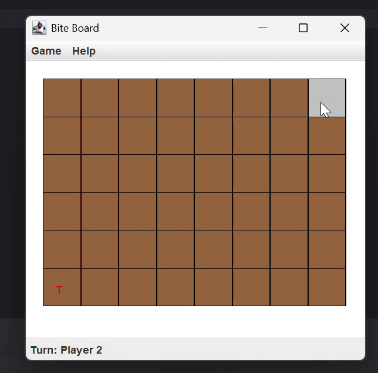

# BiteBoard Game

A 2-player Java chocolate board game with Swing GUI.

## Classes

- `BiteBoardGame` - Main class
- `BiteBoardGameModel` - Game logic
- `BiteBoardGUI` - GUI window
- `BiteBoardPanel` - Board rendering and click handling

## Gameplay



## How to Run

```bash
cd src
javac *.java
java BiteBoardGame
```
